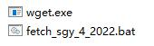
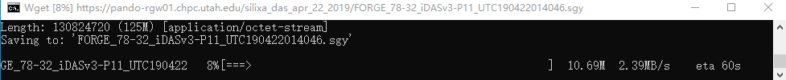

# Windows-Compatible Utah_FORGE Data Download Tool

[](https://opensource.org/licenses/MIT)

### Table of Contents
- [Overview](#overview)
- [Installation](#installation)
- [Usage](#usage)
- [Screenshots](#screenshots)
- [Credits](#credits)
- [License](#license)

## Overview
This repository contains a modified version of the [Bash script from Utah FORGE datasets](https://constantine.seis.utah.edu/datasets.html) to download seismic data. The original script has been adapted to run seamlessly on Windows with a double-click `.bat` file, providing real-time download progress and resume capability.

We utilize the [GNU Wget Windows binary plugin](https://eternallybored.org/misc/wget) to achieve this functionality. The script is written in DOS language and packaged as a `.bat` file. By using this tool, you can track download progress directly in the Windows command console. Files are downloaded to the same folder where the script is located.

## Installation
1. Download and install [GNU Wget for Windows](https://eternallybored.org/misc/wget).
2. Clone this repository to your local machine:
    ```bash
    git clone https://github.com/your-repo/windows-download-tool.git
    ```
3. Place the `.bat` script and any necessary data links into the same folder as your desired output location.

## Usage
1. After installation, navigate to the directory where the `.bat` file is located.
2. Double-click the `.bat` file to start the data download.
3. The script will show real-time progress in the console and download files to the script's current directory.
4. Example of running the tool:

    ```batch
    --202X-XX-XX XX:XX:XX--  https://pando-rgw01.chpc.utah.edu/nodal_apr2019_151/1.fcnt
    Resolving pando-rgw01.chpc.utah.edu (pando-rgw01.chpc.utah.edu)... XXX.XXX.XXX.XXX
    Connecting to pando-rgw01.chpc.utah.edu (pando-rgw01.chpc.utah.edu)|XXX.XXX.XXX.XXX|:XX... connected.
    HTTP request sent, awaiting response... XXX Partial Content
    Length: 21919519536 (20G), 20570657584 (19G) remaining [application/octet-stream]
    Saving to: '1.fcnt'
    
    1.fcnt                         75%[+++=================================>             ]  15.48G  7.72MB/s    in 28m 49s
    ```

## Screenshots
Here are some examples of how the tool looks during operation:

### 1. Folder Structure



### 2. Console Output During Download



## Credits
- Original dataset download script: [Utah FORGE Datasets](https://constantine.seis.utah.edu/datasets.html)
- Wget for Windows binaries: [Wget](https://eternallybored.org/misc/wget)

## License
This project is licensed under the MIT License - see the [LICENSE](LICENSE) file for details.
